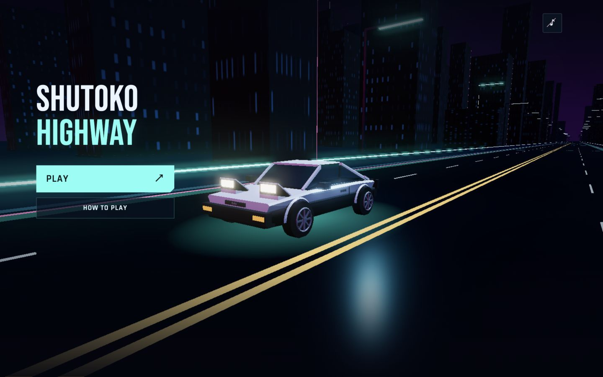
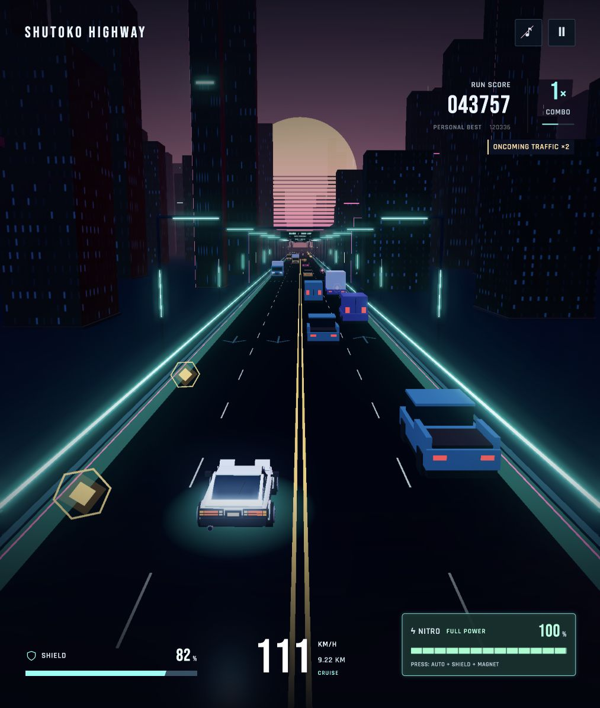

# SHUTOKO HIGHWAY

A single-player, browser-based 3D endless highway racer built with **Three.js and Vite**. Drive a stylized panda **Toyota Sprinter Trueno AE86 three-door hatchback** through a neon city, weave through two-way traffic, collect pickups, and decide when to spend your nitro.

The car accelerates automatically. Your job is to choose a safe line, manage speed with the brake, and take calculated risks for a higher score. There is no finish line: keep your shield above zero and see how far you can go.





## Contents

- [Quick start](#quick-start)
- [Controls](#controls)
- [Your first run](#your-first-run)
- [Driving and the road](#driving-and-the-road)
- [Nitro: partial boost, full boost, and banked fuel](#nitro-partial-boost-full-boost-and-banked-fuel)
- [Pickups](#pickups)
- [Shield, collisions, and recovery](#shield-collisions-and-recovery)
- [Score, combos, and near misses](#score-combos-and-near-misses)
- [Traffic and difficulty](#traffic-and-difficulty)
- [Reading the HUD](#reading-the-hud)
- [Menus, audio, accessibility, and saved data](#menus-audio-accessibility-and-saved-data)
- [Tips](#tips)
- [Build, test, and troubleshoot](#build-test-and-troubleshoot)
- [Technical reference](#technical-reference)
- [Current status and limitations](#current-status-and-limitations)
- [Assets and credits](#assets-and-credits)

## Quick start

Use **Node.js 22.12 or newer** and npm. A modern browser with **WebGL2 and hardware acceleration** is required.

From the project folder:

```sh
npm ci
npm run dev
```

Open the address printed by Vite, normally **http://localhost:5173/**. If that port is occupied, Vite may choose another one.

For another device on the same trusted local network, use the computer's local IP address and the port printed by Vite. The development server listens on all network interfaces. Your firewall and network must allow the connection; this is a local testing setup, not a production hosting service.

No account, backend, or external asset service is required. Models and effects are generated in the browser; fonts are bundled locally. Use the HTTP server rather than opening `index.html` directly from disk.

## Controls

| Action | Keyboard | Mouse / touchscreen |
| --- | --- | --- |
| Steer left / right | Hold **A / D** or **← / →** | Hold **‹ / ›** on touch layouts |
| Brake | Hold **S** or **↓** | Hold **BRAKE** on touch layouts |
| Nitro | Hold **Space**; either **Shift** key also works | Hold the nitro HUD meter or the touch **NITRO** button |
| Cancel automatic full nitro | Release the activation key, then press it again; or brake | Release, then press nitro again; or brake |
| Pause / resume | **P** or **Escape** during driving | Pause button; **RESUME** in the pause menu |
| Close instructions | **Escape** | **BACK** |
| Start | **Enter** from the main menu, or activate **PLAY** | **PLAY** |
| Retry after game over | **R**, **Enter**, or activate **RETRY** | **RETRY** |
| Sound on / off | Tab to the sound button and activate it | Music-note button |

Forward acceleration is automatic: there is no throttle key, gear shifting, or reverse control. Steering is continuous rather than a snap between lanes. Mouse steering is not implemented; desktop driving uses the keyboard.

Touch controls support simultaneous fingers, so you can steer while braking or boosting. Braking always overrides nitro. Losing focus pauses an active run and clears held inputs; resizing also clears inputs to prevent stuck controls. Pausing freezes gameplay timers, charging, fuel drain, and ability durations.

## Your first run

1. Select **PLAY**. The menu showcases the AE86 from several cinematic angles.
2. Watch the ignition: a brief stationary hold, body shudder, and light dip, followed by a gradual moving camera pullback.
3. Control begins after the camera settles and the car reaches its normal starting speed, approximately **223 km/h**. The introduction does not consume gameplay time, score, fuel, or recorded run distance.
4. On your first run, follow five short tutorial steps: steer, brake, use partial nitro, enter the opposing lanes, then return to the right lanes.
5. The tutorial removes traffic, protects the player from barrier damage, and supplies practice nitro. Finishing it starts a fresh scored run. **SKIP** also starts a fresh run and saves tutorial completion.

Tutorial completion is stored locally. You can read the controls or replay the tutorial anytime through **HOW TO PLAY**, available from the main menu and the pause/game-over dialog. Replay does not require clearing saved data.

The normal introduction lasts approximately **5.3 seconds**: a **0.8-second** ignition hold and **4.5-second** moving launch. Retries use a quicker **2.52-second** sequence. Held transition inputs are cleared before driving begins.

## Driving and the road

The four lanes are split into two directions:

| Road half, viewed while driving | Traffic | Reward |
| --- | --- | --- |
| Right two lanes | Traveling in your direction | Normal forward-driving score |
| Left two lanes | Oncoming traffic | **×2 forward-driving score**, in addition to your combo |

You may cross the double amber center line; there is no physical median. Ordinary traffic stays within its own pair of lanes. The oncoming reward applies while the player's center is across the line and the car is making forward progress. It does not double pickup or near-miss awards.

Speed represents actual travel:

- Same-direction vehicles close at **your speed minus their speed**.
- Oncoming vehicles close at **your speed plus their speed**.
- Orbs are stationary road objects, so you approach them at **your own speed**.
- Braking reduces those closing speeds. A faster same-direction vehicle can pull away from you when you slow down.

Holding the brake targets approximately **55 km/h** in open road. Behind same-direction traffic, it can slow further—even to a stop if needed—to preserve following space. This is not a guarantee against braking too late. Releasing the brake restores smooth acceleration toward the current cruise speed.

Brake lights brighten and the body pitches forward slightly. These are visual effects and do not tilt the collider. During gameplay, the camera keeps a consistent forward view without tracking lateral steering or body roll; the moving world supplies the forward-motion effect.

## Nitro: partial boost, full boost, and banked fuel

Every run starts with an **empty** nitro meter. Any positive fuel amount can be used, but starting at **exactly full** activates a different mode.

| Rule | Partial-meter activation | Full-meter activation |
| --- | --- | --- |
| How to use | Hold nitro | Press nitro once at 100% |
| Release input | Stops the boost | Keeps the automatic boost running |
| Fuel use | 10 percentage points per second | Full tank drains over **7 seconds** |
| Shield and magnet | **No** | **Yes**, for the current automatic boost |
| Cancel | Release or brake | A fresh nitro press or brake |
| Effects | Restrained flame/trail boost | Stronger burst, trails, flame, and spherical shield |

Both modes target **1.42× the current cruise speed**. The car accelerates toward that target rather than instantly changing speed. The target is roughly **317 km/h** at the start of a run and **409 km/h** at maximum difficulty. Full boost's additional power is its protection, magnet, automatic duration, and stronger presentation—not a separate speed multiplier.

### Recharging and cancellation

- Passive refill takes **30 seconds** from empty to full when uninterrupted.
- Passive charging stops during a boost.
- When boosting ends, charging resumes after a **0.75-second** delay.
- Pause freezes charge, drain, and bonus timers.
- A boost that depletes or is cancelled cannot repeatedly restart from a continuously held input. Release and make a fresh press.
- Braking cancels either mode and prevents simultaneous boost acceleration.
- The initial release after a full activation does **not** cancel it.

### Nitro orbs and the reserve

Outside automatic full boost, a cyan nitro orb immediately fills the current meter to **100%**. Collecting it during partial boost refuels that boost but does **not** add shield or magnet; those bonuses are decided at activation time.

During automatic full boost:

1. The first nitro orb fills a separate **100% banked reserve**.
2. The HUD shows **BANKED 100% · AFTER BOOST** separately from the draining active meter.
3. The current boost, shield, and magnet still end within their original seven-second window.
4. When the boost ends or is cancelled, the reserve is added to remaining fuel, capped at 100%, and the reserve clears.
5. Another boost requires fresh input. It never chains automatically.
6. Further nitro orbs collected while the reserve is already full award **100 score each**, without a combo multiplier.

There is only one tank and one full-boost reserve, not a stack of charges. An ordinary orb collected when the non-boosting tank is already full does not grant the reserve or overflow score.

The spherical shield warns during its final **two seconds**, then vanishes when protection ends. Reduced-motion mode uses a steady warning instead of pulsing. A separate, invisible **0.3-second collision grace** follows natural full-boost expiration; manual cancellation does not grant that grace.

## Pickups

| Pickup | Appearance | Benefit |
| --- | --- | --- |
| Energy | Gold geometric orb | **100 × current integer combo** score per orb |
| Repair | Pink cross | Up to **25 shield**, capped at 100 |
| Nitro | Cyan orb | Fill fuel to 100%, or bank a refill during automatic full boost |

Energy pickups normally appear in groups of three, **12 metres apart**. Repair and nitro pickups appear individually. Nitro has a **14% selection chance on an eligible spawn wave**, a **12-second spawn cooldown**, and at most one uncollected nitro orb on the road. That cooldown controls spawning, not the time between collections.

Pickups have forgiving lane-wide collection. Overlapping the pickup's lane while passing within approximately **2.5 metres longitudinally** is enough; you do not need to touch its small visible center. Full-nitro magnet attraction adds help independently of this base area.

Orbs do not drive toward you. They stay fixed to the road, with local animation only, so braking gives you more time to reach one behind traffic. They spawn beyond the visible approach zone and fade in at distance. If an orb visually covers traffic, its glow and opacity reduce so vehicle silhouettes and signals remain readable.

Gain text shows what was actually applied: for example, repairing from 92 to 100 displays **+8 Shield**. At combo ×3, one energy orb awards **+300 Energy**. Nearby rapid gains may combine. These small popups stay at their original screen position, hop upward, and fade; important status messages remain above the car.

## Shield, collisions, and recovery

The persistent **SHIELD** instrument is your health, starting at **100**. It is separate from full nitro's temporary protective sphere.

An unprotected vehicle or genuine barrier impact:

- Removes **34 shield** and resets the combo to ×1.
- Stops the active boost and driving motion.
- Plays sparks and a restrained directional body jolt during a **0.85-second** crash sequence.
- If shield remains, respawns at the recorded lateral impact position—even between lanes or in opposing traffic—with normal orientation.
- Restores speed at **32 m/s (115.2 km/h)**, then accelerates toward normal cruise.
- Clears relevant nearby traffic and grants **2.2 seconds** of blinking recovery protection.

Three unrepaired hits from full health end the run. Repairs can extend it. At zero shield, the crash sequence leads to the results screen instead of another respawn.

Full-nitro shield absorbs impacts without the normal damage/crash sequence. Recovery protection uses **vehicle blinking**, never the nitro sphere. Protection states and their timers are separate.

### Barrier contact

A new inward impact is different from continuing to touch a rail. Holding steering into a barrier or driving parallel against it does not repeatedly trigger crashes. Sustained scraping has restrained sparks. After you separate, a fresh impact can damage the car again. Protection expiration, body animation, collider resizing, and recycled scenery do not manufacture a new contact.

### Collision forgiveness

Collision bounds sit slightly inside visible bodywork, with class-specific sizes. Near-miss detection uses a separate wider envelope. At critically low health, the player's collision bounds ease slightly smaller without visually resizing the car. These are subtle assists, not permission to drive through vehicles or squeeze through a visibly blocked two-car gap. Technical values are listed below.

## Score, combos, and near misses

Let **M** be the integer part of your current combo, from 1 to 5.

| Source | Score |
| --- | --- |
| Forward progress in normal lanes | **0.45 × metres travelled × M** |
| Forward progress in opposing lanes | **0.9 × metres travelled × M** |
| Energy orb | **100 × M** |
| Completed clean near miss | **200 × M** |
| Extra nitro orb with full banked reserve | **100**, fixed |

The oncoming bonus multiplies forward-progress score only. It does not multiply recorded distance, energy pickups, near misses, or reserve-overflow score. Displayed score is rounded down; the simulation retains fractional progress score.

The combo grows by **0.055 per active second while not crashing**, capped at ×5. A completed near miss adds **0.3** to combo. The near-miss award uses the integer combo **before** that increase. Taking damage resets combo to 1. Without near misses, each integer increase takes about **18.2 seconds**.

A near miss is awarded only after a close pass is completed without contact. Lingering beside the same vehicle does not generate repeated awards. Protected overlaps during full shield or recovery do not count. A clean pass during natural nitro-expiry grace may count, but direct impacts and prolonged overlaps do not.

The personal best is saved when a run ends, if browser storage is available.

## Traffic and difficulty

Traffic uses six separate vehicle classes. Their silhouettes, lighting, dimensions, speed ranges, acceleration, and lane-change tendencies differ. The player AE86 does not share its model or materials with traffic.

Speeds below are rounded cruise ranges. Vehicles may slow below them to follow other traffic.

| Class | Cruise speed | Width × length | Nominal lane-change crossing |
| --- | --- | --- | --- |
| Truck | 65–86 km/h | 2.35 × 7.4 m | 2.6 s |
| Van | 79–104 km/h | 2.05 × 5.1 m | 2.2 s |
| Pickup | 90–119 km/h | 2.05 × 4.8 m | 1.8 s |
| Sedan | 97–130 km/h | 1.85 × 4.4 m | 1.65 s |
| Hatchback | 108–140 km/h | 1.75 × 3.5 m | 1.45 s |
| Motorcycle | 151–187 km/h | 0.75 × 2.25 m | 1.3 s |

Motorcycles have the highest cruise range and acceleration. Trucks and vans are slower and less likely to change lanes. Crossing duration varies slightly around the nominal values.

Traffic signals amber at **1.25 flashes per second**, with a clear off interval, for **2.4 seconds** before changing lanes. Signals continue through the maneuver. Destination clearance is checked in advance; unsafe maneuvers can be cancelled. Only one maneuver is active at a time, and vehicles never change across the center line.

An oncoming vehicle detecting you in its path gives a short white-headlight warning burst. This is different from its amber turn signal and is not a promise that it will avoid you.

### Distance progression

Difficulty follows a smooth curve over the first **8 km**, then caps. It is based on actual distance, not elapsed time or the speed display.

| Distance | Cruise target | Wave spacing | Chance to attempt a third vehicle in a wave |
| --- | --- | --- | --- |
| 0 km | 223.2 km/h | 150 m | 45% |
| 2 km | 233.3 km/h | 136.7 m | 52.3% |
| 4 km | 255.6 km/h | 107.5 m | 68.5% |
| 6 km | 277.9 km/h | 78.3 m | 84.7% |
| 8 km and beyond | 288 km/h | 65 m | 92% |

Each wave attempts vehicles in both directions and may attempt an additional vehicle. Clearance and escape checks can reject spawns, so these values are **not guaranteed population counts**. Traffic is capped at **48 active vehicles**.

Spawns are at least **320 metres ahead**, with additional lead distance for closing speed and oncoming maneuvers. The baseline reaction allowance is **3.2 seconds**. Encounter checks reserve escape opportunities at current and maximum boost pace. This reduces unfair patterns but is not an exhaustive guarantee for every random situation or player input.

## Reading the HUD

- **Speed:** actual current km/h; the adjacent status identifies cruise, braking, boost, crash, or recovery.
- **Shield:** current health out of 100; low-health coloring warns when it is depleted.
- **Nitro:** current fuel, or remaining automatic-boost window while full boost is active.
- **CHARGING / AVAILABLE:** empty or partially filled fuel. Partial fuel is usable even before the meter is full.
- **FULL POWER:** ready for automatic boost, shield, and magnet. A one-time entrance animation is followed by a restrained pulse.
- **BOOST / OVERDRIVE:** partial boost or full boost with bonuses. The full-boost hint shows actual remaining protection time.
- **BANKED:** stored refill for after the current automatic boost; it does not extend active protection.
- **Score and combo:** current run score, personal best, integer multiplier, and progress toward the next multiplier.
- **ONCOMING TRAFFIC ×2:** a fixed HUD indicator while driving in opposing lanes. A short display delay prevents center-line flicker; scoring follows actual position.
- **Above-car feedback:** concise major events such as near misses, full nitro, crashes, and recovery. Related events are combined or prioritized instead of forming a long queue.
- **Pickup feedback:** smaller, independent gain amounts at the pickup's screen position.

The day/night ambience completes a **90-second gameplay-time cycle**. It is visual ambience, not an additional weather or handling system.

## Menus, audio, accessibility, and saved data

**PLAY** is the primary menu action. **HOW TO PLAY** stays available before a run and from pause/game over. Help can be closed with **BACK** or **Escape**; keyboard focus returns to its opening button. Closing help from pause does not resume driving automatically.

The menu opens automatically and silently. PLAY unlocks synthesized starter, engine, pickup, boost, near-miss, and impact sounds; the music-note button enables or mutes them. An explicit mute is respected on subsequent starts. There is no music soundtrack or separate volume mixer. Sound preference is not saved across page reloads.

The game respects the browser/OS **reduced-motion** preference: cinematic motion and body movement are reduced, shield-expiry feedback becomes steady, and decorative HUD motion is reduced. This does not stop road motion or change gameplay rules. Menus support keyboard navigation, controls have accessible labels, and some events have live announcements; the visual driving game is not fully playable nonvisually.

Local browser storage contains:

| Key | Purpose |
| --- | --- |
| `neon-racing-best` | Best completed-run score |
| `shutoko-tutorial-complete` | Whether onboarding has been completed or skipped |

Progress is specific to the browser and origin. Different hostnames or ports may have different saved data. There is no cloud save, account sync, online leaderboard, multiplayer, or saved in-progress run. Storage restrictions may prevent persistence; the game can still run. Clearing site data removes the saved best and tutorial flag.

## Tips

- Brake **before** a gap disappears. Closing speed matters more than the number on the speedometer.
- Treat the right lanes as a safer baseline, not a completely safe zone: slower trucks can form queues.
- Cross into opposing lanes with an exit in mind. Watch for white headlight warnings and amber lane-change signals.
- Use a small partial boost for a short opportunity. Save a full tank when shield and magnet are worth more than immediate speed.
- During full boost, a cyan orb sets up your **next** boost rather than extending the current protection.
- Do not chase a repair through a blocked gap. Repairs help only if you reach them without another crash.
- Near misses reward finished clean passes. Staying beside a vehicle is not a scoring exploit.
- During recovery blinking, plan the next opening; protection lasts only 2.2 seconds.

## Build, test, and troubleshoot

### Commands

| Command | Purpose |
| --- | --- |
| `npm ci` | Install the versions recorded in the lockfile |
| `npm run dev` | Start Vite's development server |
| `npm test` | Run Node's automated test suite |
| `npm run build` | Generate the production site in `dist/` |
| `npm run preview` | Serve the production build locally for inspection |

Publish the contents of `dist/` with a static web host. The current configuration uses root-relative asset paths; hosting at a domain root is the straightforward setup. Subdirectory hosting needs asset-path/base configuration work. No backend deployment is needed. Do not use the development server as a production service.

### Troubleshooting

| Symptom | What to check |
| --- | --- |
| Blank scene or “3D UNAVAILABLE” | Use a WebGL2-capable browser with hardware acceleration. Update the browser/GPU driver if needed. |
| Page fails when opened from disk | Run Vite and use its HTTP URL instead of `file://`. |
| Phone cannot reach the local server | Check the computer's local IP, printed port, shared network, and firewall. `localhost` on the phone points to the phone itself. |
| No sound | PLAY enables sound unless explicitly muted. Check the note button and browser/device audio settings. |
| Nitro will not engage | Check fuel, braking, crash state, and whether you need to release a depleted/cancelled hold before pressing again. |
| Nitro orb did not lengthen the shield | Intended: automatic-boost pickups bank the next refill. Current shield/magnet never extend beyond the original window. |
| Game paused after changing tabs | Intended focus-loss protection. Return and choose Resume. |
| Steering stopped after resizing | Held inputs are cleared on resize. Release and press again. |
| Saved best/tutorial appears missing | Check browser storage permissions and whether the hostname/port changed. |
| Low frame rate | Verify hardware acceleration, close other GPU-heavy tabs, and try a smaller browser window. There is no in-game graphics-quality selector. |
| WebGL context was lost | Reload the page when the interruption message appears. The current run is not saved. |

### Development verification

`tests/browser-lab.html` is a development-only fixture available through the dev server. It exercises the real renderer and UI with repeatable scenarios: braking behind an orb, both barriers, full/partial nitro, shield expiry, crashes, traffic classes, late traffic, menu angles, and repeated pool reuse. Some buttons inject test state or synthetic input. It is not a second game mode and is not included in the production build.

The automated suite covers gameplay timing, scoring, collisions, barrier contact, pickup forgiveness, near misses, banked nitro, protection expiry, restart/pause behavior, keyboard/multi-pointer input, camera motion, model geometry, and bounded visual reuse.

## Technical reference

### Rendering and simulation

- Three.js renders procedural vehicle/environment geometry, bloom, lighting, particles, trails, and the spherical shield. HTML/CSS provide the HUD and menus.
- The main loop advances gameplay at **120 fixed simulation steps per second**. Rendering follows the browser frame loop.
- World distances and speeds use **metres and seconds**; the HUD converts speed to km/h.
- The player stays near the local origin while the road/environment scroll. The gameplay camera does not follow steering. Menu camera motion is separate.
- The AE86's headlights are **permanently raised at 0.62 radians (about 35.5°)**, with forward-facing lamps and fitted white hood bodywork. There is no opening/closing animation. Ignition light flicker remains.
- Body pitch, roll, crash motion, and ignition shudder are visual-only. Underglow is road-aligned rather than inheriting those body rotations.
- Rendering pixel density is capped at **1.5×**. Scenery uses camera-aware distance/frustum visibility and simpler distant detail; rendering visibility does not replace traffic simulation.
- Traffic is pooled by vehicle type, pickups are pooled, and particles/trails use bounded storage. Road and environment pieces recycle outside the intended visible region.

### Tuning and collision details

Most gameplay values live in [`src/tuning.js`](src/tuning.js). Do not assume a declared constant is used by every subsystem; inspect the relevant implementation when changing behavior.

| Setting | Current value |
| --- | --- |
| Player reference collider size | 1.72 × 3.4 m |
| Baseline player width factors | 0.88 × 0.94, about **17.3% narrower** than reference |
| Baseline player length factors | 0.96 × 0.99, about **5.0% shorter** than reference |
| Low-health assistance threshold | Below 25 shield |
| Maximum extra low-health reduction | Up to 7% width / 1.5% length, blended smoothly |
| Minimum player width / length factors | 0.76 / 0.93 of reference |
| Natural full-nitro expiry grace | 0.3 s; no new visual effect |
| Barrier planes | Centers at ±6.9 m, thickness 0.22 m |
| Barrier impact criterion | Fresh inward contact at ≥1.2 m/s lateral velocity |
| Barrier separation needed to re-arm | 0.06 m clearance |
| Pickup spawn distance | At least 760 m, with additional speed-based lead |
| Pickup fade range | Invisible at 650 m; fully revealed by 420 m |
| Pickup longitudinal reach | ±2.5 m, with swept detection |
| Pickup lane overlap envelope | 1.5 m lane half-width + 1.05 m player pickup half-width |
| Full-nitro magnet attraction | Within 6 m laterally, from 24 m ahead to 3 m behind |
| Shield visual radius | 2.05 m, uniform sphere |
| Impact particle budget | 96 |
| Trail samples | 36 per rear-lamp trail |

Traffic uses class-specific reduced collision sizes and a conservative yaw allowance while changing lanes. Near-miss proximity remains separate from physical collision bounds. Collider growth after health recovery cannot alone trigger a new impact. A vehicle already overlapping during expiry grace remains exempt from that same contact until separation, without protecting against unrelated vehicles.

These rules are implemented in [`collision-bounds.js`](src/collision-bounds.js), [`barriers.js`](src/barriers.js), [`pickups.js`](src/pickups.js), and [`simulation.js`](src/simulation.js).

### Source map

| File / area | Responsibility |
| --- | --- |
| `src/main.js` | Main loop, menu flow, HUD wiring, local storage |
| `src/simulation.js` | Run state, scoring, spawning, collision outcomes, recovery |
| `src/tuning.js` | Central gameplay and visual limits |
| `src/nitro.js` | Fuel, partial/full modes, reserve application, bonuses |
| `src/traffic.js` / `src/traffic-model.js` | Traffic movement/decisions and separate visual models |
| `src/braking.js` | Brake target and traffic following |
| `src/hero-car.js` | Player-only AE86 geometry, materials, effect attachment points |
| `src/scene.js` | Renderer, environment, camera integration, object visibility |
| `src/vehicle-motion.js` | Body presentation and gameplay camera framing |
| `src/menu-camera.js` / `src/launch.js` | Menu shots and moving engine-start handoff |
| `src/protection.js` | Shield shape/warning and recovery blink |
| `src/scene-effects.js` / `src/render-reuse.js` | Flames, trails, impacts, bounded visual pooling |
| `src/pickup-visibility.js` | Pickup distance fade and traffic-priority visibility |
| `src/road-motion.js` / `src/environment-motion.js` | Signs and environment recycling |
| `src/hud.js` / `src/score-feedback.js` | Nitro readiness and vehicle-anchored messages |
| `src/pickup-feedback.js` / `src/oncoming-hud.js` | Independent gains and stable opposing-lane indicator |
| `src/tutorial.js` / `src/input.js` | Onboarding and keyboard/pointer state |
| `src/audio.js` | Synthesized engine, ignition, and event sounds |
| `src/style.css`, `src/typography.css`, `src/menu.css` | Layout, fonts, feedback styling, responsive dialogs |
| `tests/` | Automated tests and browser fixtures |
| `docs/` | Current screenshots, original design, and final review evidence |

## Current status and limitations

The latest final-polish review recorded **140 passing automated tests** and a successful production build. The browser review included a **159-second, 9.2 km test-driver run** past the difficulty cap and three separate **240-second seeded simulation runs**. Later traffic became measurably denser. Desktop browser samples reported roughly **119–120 FPS**, with stable geometry/texture counts after warm-up.

Those observations are not a guarantee of performance on every device or proof that every random traffic pattern is fair. The sustained run used a test driver, not an independent human player. Portrait **390×844**, landscape **844×390**, and desktop **1440×900** layouts were inspected; physical-phone GPU performance, touch ergonomics, audio quality, and thermal behavior still need device testing.

The game is ready to share as a **desktop-first playable beta**. Remaining limitations include repeated straight-road scenery/encounters, small distant traffic in portrait framing, relatively simple traffic/environment art, and no audio listening assessment in the recorded review. No additional feature is required to try the current game.

See the [full assessment and verification evidence](docs/review/notes.md). The original design in `docs/game-design.md` is historical; superseded iteration notes and screenshots have been removed. This guide describes the current implementation; source remains authoritative when tuning changes.

## Assets and credits

Vehicle models, scenery, textures/effects, and audio synthesis are implemented locally. The game does not download models, textures, or fonts from third-party services at runtime.

Bundled fonts:

- **Bebas Neue** for display typography, exposed internally as `NeonArcade` — [license](public/fonts/OFL-BebasNeue.txt).
- **Rajdhani** for readable labels and instructions — [license](public/fonts/OFL-Rajdhani.txt).
- **Tomorrow SemiBold Italic** for pickup gains — [license](public/fonts/OFL-Tomorrow.txt).

Font files include their SIL Open Font License notices. Library licenses are supplied with the installed dependencies. No project-wide license is currently included; font or dependency licenses should not be treated as a license for the entire repository.

The player is a stylized depiction of the Toyota Sprinter Trueno AE86. Toyota and vehicle names belong to their respective owners; this project does not claim official affiliation. UI direction draws on neon arcade games, Cyberpunk 2077-inspired pickup typography, and the project's earlier SpaceAttack Nova-bar reference work; it does not bundle those games' proprietary assets.
