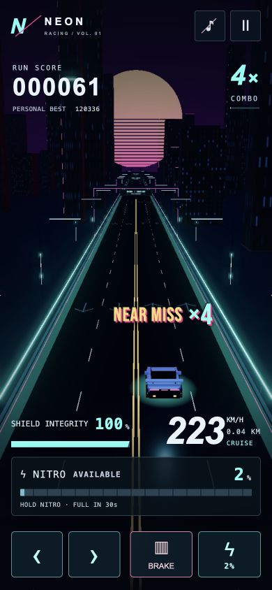

# Arcade feedback and traffic visibility

## Presentation

- Locally bundled Bebas Neue Regular, copyright Dharma Type, SIL Open Font License 1.1. Font and complete license are in `public/fonts`. Source: https://github.com/google/fonts/tree/main/ofl/bebasneue. Routine HUD fonts are unchanged.
- A single projected screen-space popup follows the player. Near misses and integer combo milestones coalesce into `NEAR MISS ×N` or `COMBO UP ×N`. Updates replace the existing popup. A 160 ms scale punch, 9 px upward kick, short hold, and 350 ms exit fit a 1.4-second lifetime. Higher tiers increase the punch and use warm yellow accents. Simulation time controls lifetime; crash, pause, menus and restart hide/reset it. Horizontal margins and a vertical safe region keep it away from HUD/touch controls.
- Nitro-ready entrance uses a 500 ms scale/bounce and 620 ms energy sweep, once per ready transition. Persistent scale ranges 1.01–1.06 over 1.8 seconds, with a restrained 3 px bounce every 3.6 seconds and a slow accent glow. Activation cancels ready animations and resets scale. Reduced motion removes movement/sparks and the repeating glow, preserving the solid ready border and readable meter.

## Traffic priority

Orb shells are smaller and their base opacity drops from 0.16 to 0.07. Every frame, traffic and orb bounds are projected through the actual camera. If an orb overlaps a vehicle behind it on screen, the whole pickup fades toward 12% opacity with an 18/s response. Restoration is slower, 5/s, avoiding boundary flicker. Headlights and signal margins are included, as are taller trucks and motorcycle/rider silhouettes. Native depth testing is retained. The thin faded ring remains a pickup cue; no extra particles obscure traffic.

This is visual only: spawn distances, physical pickup detection, magnet movement, collision rules, scores, speeds, and difficulty are unchanged. Projected bounds are recomputed during steering, lane changes, FOV changes, and magnet attraction.

## Verification

- 93 automated tests pass; production build passes. New tests cover event coalescing, screen-edge bounds, timed expiry/reset, reduced-motion popup behavior, screen/depth overlap, smooth fade and restoration. Existing HUD tests cover one-shot readiness and activation modes.
- Browser: bundled font reported loaded after the popup rendered. Rapid events combined into one `NEAR MISS ×4`; desktop and 390×844 mobile layouts stayed readable, without horizontal overflow.
- Browser fixtures placed orbs ahead of oncoming motorcycles, sedans and trucks. Each smoothly reached approximately 13% opacity within 0.25 seconds while vehicle silhouettes remained visible.
- Mobile full-ready transitioned to active full boost with persistent-ready scale reset to 1; distinct shield/magnet state remained intact. Independent code review found no actionable issues.
- Reduced-motion logic was tested programmatically; physical mobile devices and an extended maximum-speed subjective playtest were not performed in this pass.

