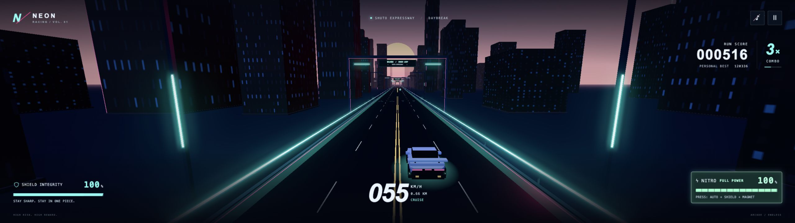

# Collision forgiveness and pickup visibility

Latest tuning, 2026-10-05. These values supersede collider values in earlier notes. Driving speeds, traffic difficulty, controls, and the near-miss proximity envelope are unchanged.

## Physical bounds

| Vehicle | Additional width reduction | Total width reduction from body | Total length reduction |
| --- | --- | --- | --- |
| Player | 6% | 17.28% | 4.96% |
| Truck / motorcycle | 5% | 14.50% | 3.49% |
| Van / pickup | 6% | 17.28% | 4.96% |
| Sedan / hatchback | 7% | 19.09% | 5.95% |

Additional length reductions are only 0.5–1%. Below 25 health out of 100, the player smoothly gains up to another 7% width and 1.5% length reduction. The limiting total reductions are 23.07% width and 6.39% length, with hard safety caps at 24% and 7%. Exponential response is 8/s entering and 3/s restoring. Rendering and HUD do not reveal this assistance.

A contact caused solely by health-related collider expansion retains its previous bounds until separation. Moving further into that vehicle can still cause a genuine collision. Substantial two-sided body penetration (over 0.2 m per side) between parallel vehicles registers an impact instead of letting reduced colliders create an implausible passage. Single clean overtakes retain the intended forgiveness.

## Natural nitro expiry

Only natural full-mode expiration grants 0.3 seconds of hidden collision grace. Boost, visible sphere, magnet, and HUD end normally. Grace contacts emit no damage, crash, particles, or hit sound. A physical contact is tracked per vehicle until separation, preventing a delayed impact when grace expires without protecting against unrelated vehicles.

Clean completed proximity passes can score during grace. Physical overlaps are disqualified, including overlaps that span expiry; lingering never yields repeat rewards. Active shield and respawn protection keep their existing disqualification rules. Cancellation grants no grace. Pause freezes the timer; restart resets it.

## Orb lifecycle

The old 130 m spawn occurred well inside the scene's atmospheric range and caused pop-in. Pickups now spawn at least 760 m ahead, including a maximum-speed lead allowance. A smooth distance fade runs from zero at 650 m to full opacity at 420 m, before the close collection region. Pool activation reapplies visibility and material opacity every frame. The bounded population allowance is 40 so the longer approach does not prematurely throttle pickup groups.

Orbs remain stationary in world space. Player motion alone drives their longitudinal approach; lane-wide collection and temporary magnet movement are unchanged.

## Verification

- 90 automated tests pass, including class-specific clean passes and frontal impacts, natural/manual nitro endings, grace spanning contact, separation and re-entry, unrelated contacts, duplicate scoring, health restoration beside traffic, pause/restart, far spawning and pooled opacity reset.
- Review exposed a parallel-sedan penetration case; a failing regression reproduced it before the two-sided contact guard was added. Its grace-expiry variant also passes.
- Browser fixture at 2560 × 720: stationary orb starts invisible beyond 730 m, then approaches to full visibility around 100 m at both 55 and 409 km/h. Traversing 660 m took 43.2 s and 5.8 s respectively. No damage or camera lateral movement occurred.
- Browser parallel-overlap fixture registers one crash, reducing shield from 100 to 66, with visible impact particles rather than allowing passage through both cars.
- Production build succeeds. Physical mobile hardware was not tested in this pass.

