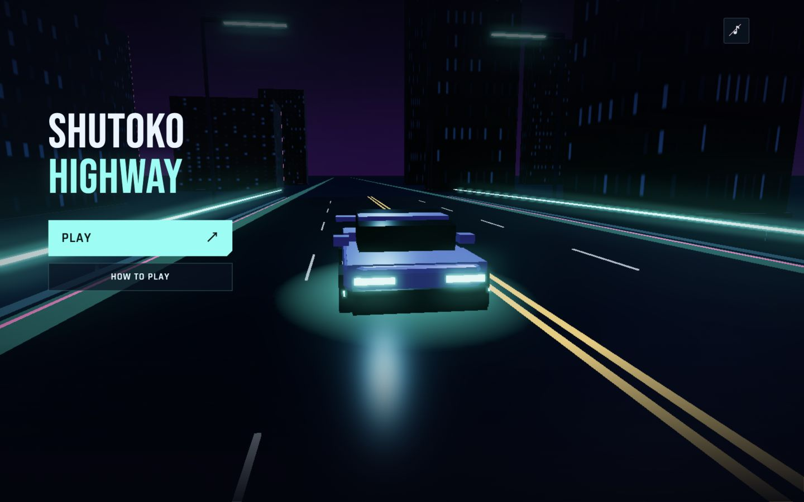
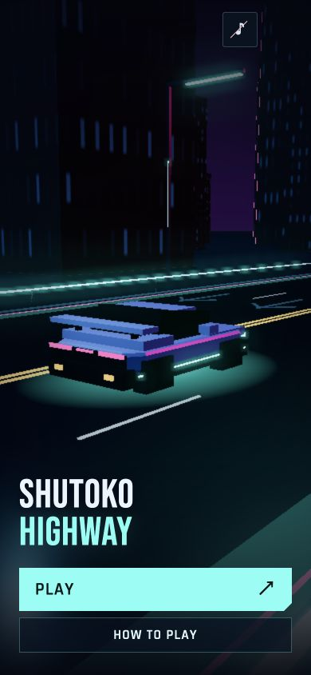
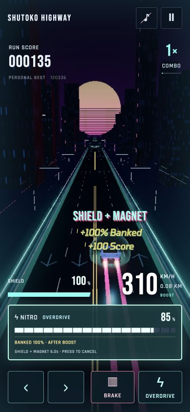

# Menu, startup, tutorial and nitro reserve

## Behavior

- A nitro orb collected during automatic full nitro banks a 100% refill separately from active fuel. The HUD labels it `BANKED 100% · AFTER BOOST`. A further orb while the bank is full awards 100 score. Pickup feedback reports the actual banked percentage or score.
- Expiry or cancellation applies the bank, capped at 100%, without extending the original seven-second boost, shield or magnet. Held input cannot trigger another boost; a fresh press is required. Ordinary partial-boost and cruise pickups retain their existing behavior.
- SHUTOKO HIGHWAY is the menu title. PLAY is primary; HOW TO PLAY and sound remain visible. Instructions are also available from pause and game over. Decorative labels were removed.
- Five stationary-car camera compositions blend over seven-second shot intervals. The gameplay camera remains unchanged. Startup holds the cinematic view for 0.8 seconds for ignition, then accelerates smoothly over 4.5 seconds while the camera pulls back. Retries use a 0.32-second ignition hold and 2.2-second moving launch. Reduced motion keeps the camera fixed at the gameplay pose. Only visual road travel advances during launch: gameplay time, scoring, distance, fuel and hazards begin at handoff.
- Starter, ignition, small mechanical shudder and a single light dip share the startup timeline. Muting suppresses audio. Focus loss stops the starter and freezes the transition; focus restoration restarts ignition if still in the stationary phase, or resumes the moving launch without a speed reset.
- A safe five-step tutorial teaches steering, brake, nitro, opposing lanes and returning to the right lanes. It uses touch or keyboard prompts, has a skip button, saves completion locally and can be replayed through HOW TO PLAY. Completing or skipping starts a fresh normal run.

## Verification

- 112 automated tests pass, including reserve overflow, natural expiry, cancellation, fresh-input gating, restart reset, frozen intro simulation, continuous camera paths, reduced-motion framing, tutorial progression and startup audio scheduling/muting/interruption.
- Production build and whitespace checks pass. The existing Three.js bundle-size advisory remains.
- Browser checks at 1440 × 900 and 390 × 844 verified menu layout, visible instructions, duplicate Play protection, startup, pause instructions, tutorial skip, returning-player behavior and replay through all five actions.
- A live pickup fixture showed +100% Banked and +100 Score during full nitro, followed by a full ready meter with no automatic restart after expiry. Cancellation is covered by deterministic tests.
- Sound-enabled startup ran in the actual browser. Physical audio playback quality and physical mobile hardware were not assessed; audio scheduling is covered by a mocked AudioContext test. Reduced motion is covered by camera and presentation tests.

## Moving launch verification

The browser fixture recorded 0 speed and unchanged camera during ignition; 31.019 m/s and 26.184 m of visual travel halfway through pullback; then exactly 62 m/s (223.2 km/h) and the same settled camera position on both sides of handoff. Time, score and gameplay distance were zero throughout the introduction. No browser errors were recorded. Automated checks cover the integrated speed curve, zero endpoint acceleration, camera hold and exact endpoint, reduced motion, and clearing held-key repeats so transition input cannot activate nitro. Normal driving tuning is unchanged.
