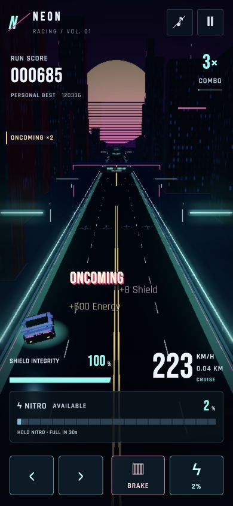
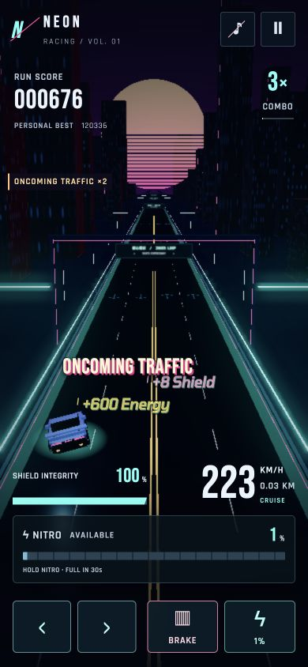

# Pickup gains and compact status feedback

Pickup collection records the actual applied resource delta plus a copy of the orb position before despawning. A repair at 92 health reports `+8 Shield`; energy uses the actual score awarded with its multiplier. Nitro reports the fuel percentage actually added. Zero gains create no amount popup. Nitro/full-shield status events occur only on a transition into full, never when collecting again at capacity.

`src/pickup-feedback.js` owns an independent screen-space layer. Collection positions are projected once and retained during steering and camera movement. Text makes one small upward hop and fades over 1.1 seconds. Same-type pickups within 70 pixels and 0.3 seconds combine without moving their original origin or prolonging their lifetime. The layer is capped at four messages. Unlike nearby gains separate vertically, and positions clamp to the viewport after resizing. Crash/restart clears pickups; pause hides and freezes them.

Amounts use locally bundled Rajdhani Regular (400), 19 px desktop / 17 px mobile, with only a small contrast shadow. The existing SIL OFL license covers this weight. Major status retains the larger display style. Compact labels include `Nitro Full`, `Shield Fully Restored`, `Recovery Protection`, and `Shield + Magnet`.

Oncoming gameplay and rewards are unchanged. A side indicator displays the configured active multiplier while actually oncoming. The car popup says `ONCOMING` on entry. It rearms only after 0.45 seconds continuously outside opposing traffic, suppressing center-line jitter without delaying side-indicator removal.

Verification: 100 tests pass, including capped gains, copied positions, full transitions, fixed origins, merge/lifetime/population limits, and oncoming jitter. Production build succeeds. Browser checks at 390×844 and 1440×900 showed +8 Shield and combined +600 Energy without overflow, distinct lighter text, and both oncoming indicators. Regular font loading confirmed in the renderer. Independent review found no actionable issues. Physical mobile devices were not tested.

## Cyberpunk 2077 typography refinement

Both indicators now say `ONCOMING TRAFFIC`; the side indicator retains its configured multiplier. Behavior, entry debounce, pickup positions, hop/fade lifetime, and all gameplay values remain unchanged.

Visual reference inspected: [CD Projekt Red's official Cyberpunk 2077 presentation](https://www.cyberpunk.net/en/news/49696/cyberpunk-2077-ultimate-edition-is-out-now). Pickup lettering uses the separately licensed Tomorrow SemiBold Italic, with compact horizontal proportions, angular glyphs, yellow/cyan contrast, a small sharp accent and restrained offset shadow. The font is locally bundled with its SIL OFL 1.1 license. Size is 23 px desktop and 20 px mobile, below major status sizes. The longer oncoming popup has 20 px extra clearance above pickup amounts.

Browser verification: actual Tomorrow font loaded at 390×844 and 1440×900; both full oncoming labels displayed correctly. At 320×640, +1000 Energy and +100% Nitro stayed fully inside the viewport. Independent review found no actionable issue. All 100 tests and the production build pass.

