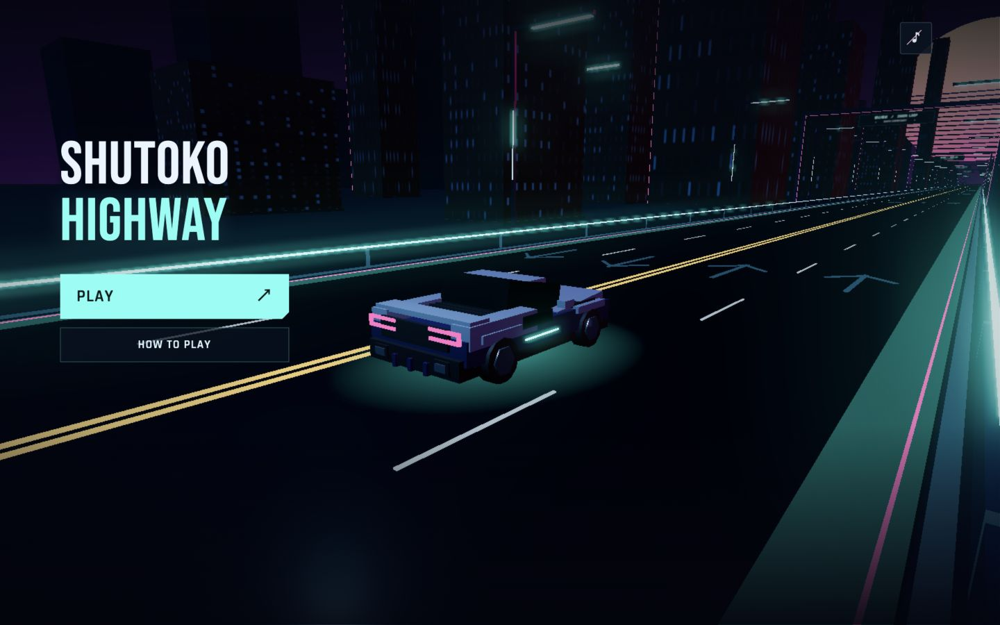
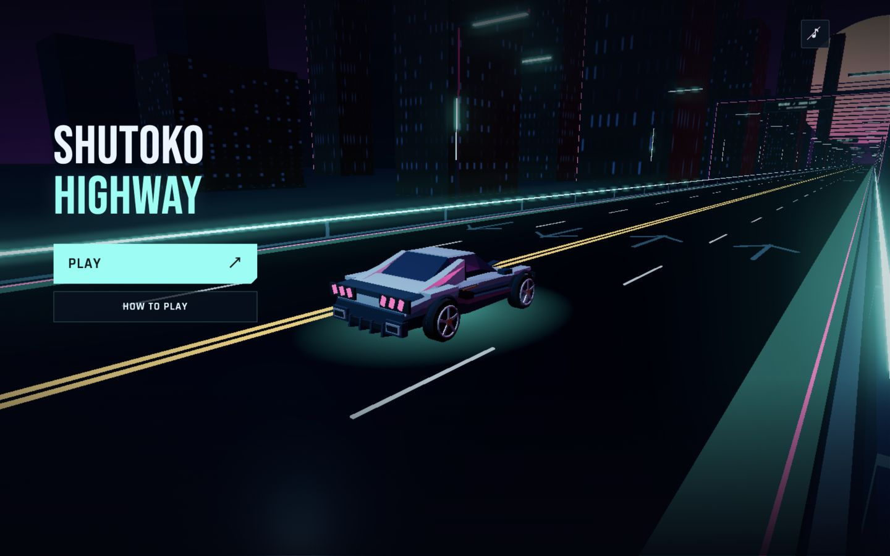
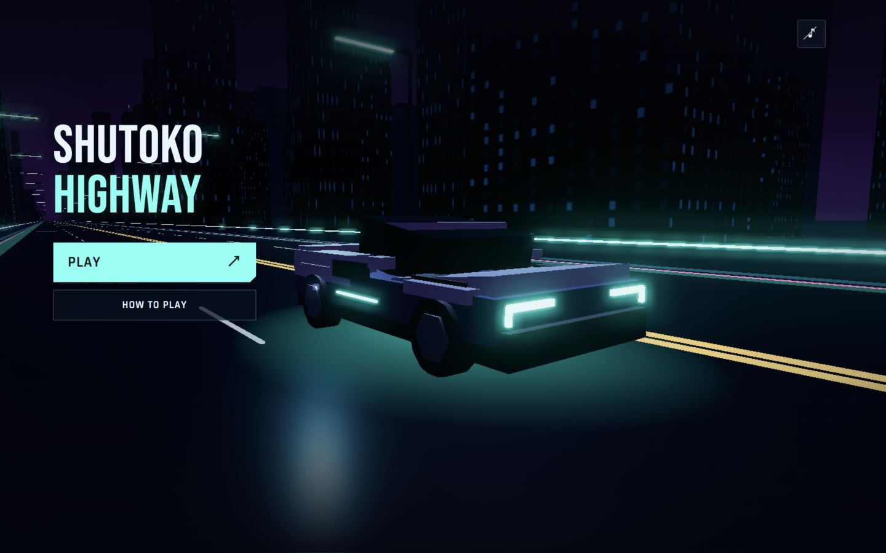
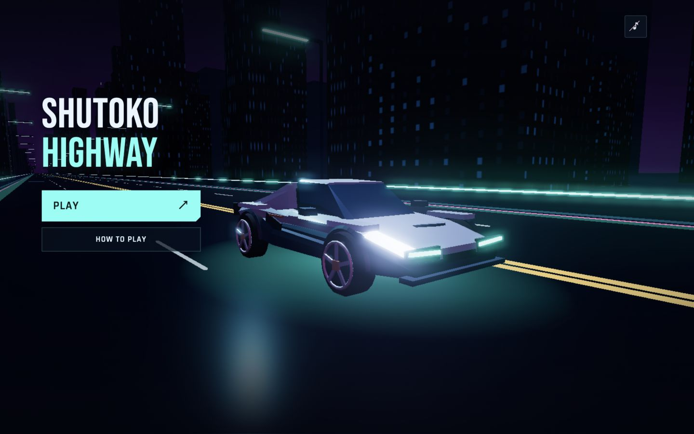

# Player-only wedge coupe redesign

Only `src/hero-car.js` changed in production code. Traffic model, simulation, tuning, effect and vehicle-motion files were checksum-verified unchanged.

The block-shaped body was replaced by nine profiled surfaces: a low spear nose, pinched waist, rising rear shoulders, tapered glass canopy and twin rear buttresses. Five-spoke wheels have recessed centers and outer rims. Materials combine pale metallic upper panels, dark blue lower surfaces, smoked glass and restrained copper accents. Three slanted light blades per side form the brake signature; inset twin exhausts and four diffuser fins define the rear.

The approximately 1.885 × 1.038 × 3.444 m rendered envelope remains compatible with existing gameplay dimensions. Collision bounds, speed, handling and menu camera are unchanged. Original tail/edge materials and body/glow interfaces continue to drive braking, ignition, pitch, roll, crashes, flames, ribbons and the shield.

Verification: 135 tests pass, production build succeeds, no browser errors. Reviewed finite geometry/normals, material isolation, body envelope, brake response and underglow. Browser checks covered matching front/rear menu angles, phone-sized rear view, steering plus braking, full nitro/shield/flames/trails, and crash animation.

## Rear — identical camera

| Before | After |
| --- | --- |
|  |  |

## Front — identical camera

| Before | After |
| --- | --- |
|  |  |
