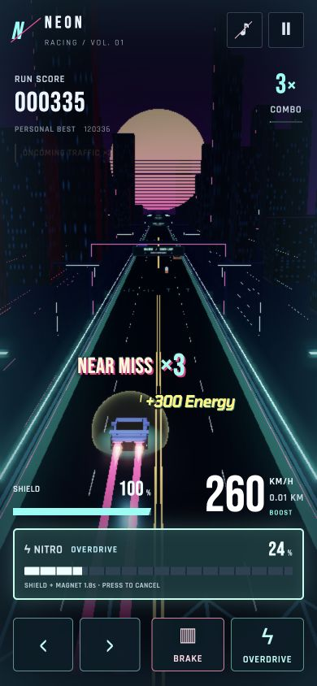

# Shield expiry and HUD hierarchy

The nitro sphere starts its warning at two seconds of actual `bonusTime` remaining. A continuous phase ramps pulse frequency from 1 to 2 Hz, with opacity modulation bounded to 0.65–1 and a brighter warm rim. The sphere remains recognizable and disappears at the original protection expiry. Reduced motion uses a steady warm rim and freezes the decorative scan. The invisible 0.3-second grace remains entirely unchanged and unannounced.

Oncoming traffic is now exclusively an existing HUD label beneath the score block, including its configured multiplier. There is no vehicle entry popup. UI-only dwell is 0.18 s entering and 0.28 s leaving, followed by a 220 ms fade / 3 px slide, suppressing boundary chatter. Reward activation and traffic behavior still use the unchanged simulation state. The label sits 12 px below the score block, so desktop, mobile and landscape typography determine its position naturally.

HUD refinements: shorter SHIELD label, clearer numeric contrast, quieter secondary text, removal of the decorative shield caption and redundant braking popup, smaller/slower ready pulse without periodic bounce, no perpetual charging sweep, and a centered 1280 px maximum instrument span on ultrawide displays. Full-nitro entrance, combo/near-miss feedback, pickup typography/motion, and gameplay tuning are preserved. Touch tablet control clearance remains 106 px.

Verification:

- 102 automated tests pass; production build succeeds.
- Warning tests cover actual remaining protection versus fuel, bounded modulation, steady reduced motion, natural expiry, manual cancellation, and hidden grace. Existing gameplay regression tests remain passing.
- Busy browser fixtures combine oncoming traffic, a near miss/combo, an energy pickup, and shield expiry at 390×844, 844×390, and 2560×1080. The warm warning sphere is visible before expiry; the fixed oncoming label stays out of the road center. No browser errors or ultrawide overflow.
- Review found landscape score overlap and coarse-pointer tablet clearance issues. The final label is positioned relative to the score block, and tablet clearance is restored. Browser landscape measurement confirms separation even during its entrance slide.
- Reduced-motion behavior is verified programmatically; physical touch devices were not tested.

