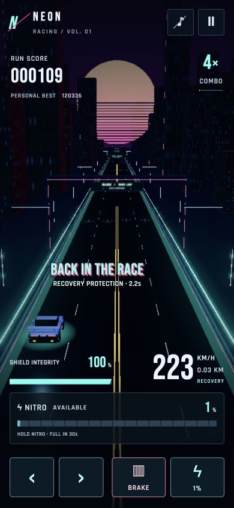

# Unified vehicle messages and typography

All transient gameplay messages now share `src/score-feedback.js` and one projected overlay above the player. The toast, boost/recovery banner, and oncoming banner have been removed from markup and styling. Persistent speed, health, drive status, and nitro instruments remain in the HUD.

The single slot has no queue. Crash → recovery → protection/critical health → oncoming warning → nitro activation/readiness → near misses/combos → ordinary rewards is the priority order. Respawn explicitly replaces the completed crash, even if its popup lifetime has not expired. Near misses and multiplier changes combine; recovery text combines with “Back in the Race.” State notifications occur only on entry, and exit invalidates the corresponding message. Pause clears stale messages, restart resets history, and crash replaces rewards.

Score notifications retain their 1.4-second lifetime; other messages retain 1.65 seconds. Both use the same scale punch, upward kick, hold and 350 ms exit. Text wraps within bounds that reserve room for the maximum punch. Reduced motion keeps readable static placement and opacity exit.

`src/typography.css` centralizes families, weight, size tokens, numeric styling and arcade shadows, with compact mobile/short-screen tokens. Bebas Neue provides display lettering and numerals; Rajdhani SemiBold provides labels, controls and instructions. Both are locally bundled under SIL Open Font License 1.1 with license files under `public/fonts`. Rajdhani source: https://github.com/google/fonts/tree/main/ofl/rajdhani.

Verification:

- 96 tests pass and production build succeeds.
- New tests cover safety priority, dropping lower-priority bursts without queuing, oncoming entry/exit, pause clearing, and the actual 0.85-second crash-to-respawn message handoff.
- Independent review found the crash priority handoff issue; it was corrected and regression tested.
- Browser: both fonts reported loaded in the real game. Menu and HUD checked at 390×844; narrow gameplay checked at 320×640 with no horizontal overflow.
- A rapid recovery/oncoming/combo/near-miss/reward burst retained only the recovery notification. DOM audit confirmed zero old banners.
- Actual crash displayed CRASH, then BACK IN THE RACE / RECOVERY PROTECTION. Narrow-screen oncoming warning and reward multiplier remained within viewport bounds. Long text remained legible above the car.
- Physical mobile hardware was not tested.

